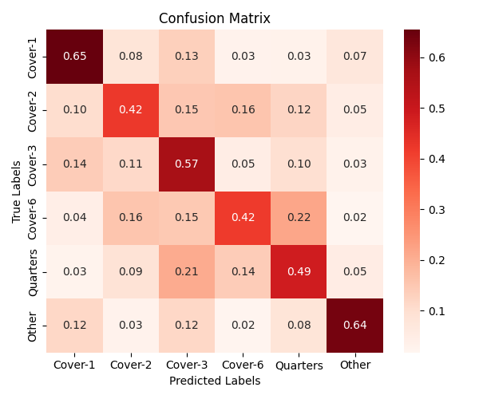
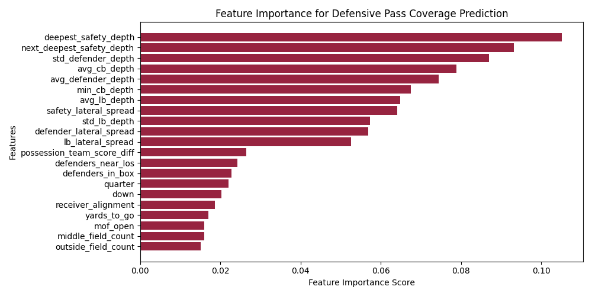

# Predicting NFL Defensive Pass Coverages Pre-Snap using Random Forest

This project uses a **Random Forest classifier** to predict pre-snap **NFL defensive pass coverages** (e.g., Cover-1, Cover-2, Cover-3) using **spatial/positional** and **game-state** features from the **NFL Big Data Bowl 2025 dataset**.

**Author:** Louis DiMuro

[📄 Read the Full Paper (PDF)](Predicting_NFL_Defensive_Pass_Coverages_Pre_Snap_with_Random_Forest_Classification.pdf)

---

## Overview

- **Dataset:** 8,278 passing plays from the 2022 NFL season (Weeks 1–9)  
- **Labels:** 6 defensive coverage classes  
- **Features:** 21 pre-snap features (spatial + game-state)  
- **Model:** Random Forest  
- **Baseline Accuracy:** 31.76%  
- **Model Accuracy:** **55.86%** (75.9% improvement)

---

## Objective

1. **Predict** the defensive pass coverage before the snap
2. **Identify** the most important features contributing to these predictions

---

## Features Used

### Spatial/Positional Features:
- `deepest_safety_depth`, `next_deepest_safety_depth`
- `avg_cb_depth`, `min_cb_depth`
- `avg_lb_depth`, `lb_lateral_spread`
- `defenders_in_box`, `defenders_near_los`
- `middle_field_count`, `outside_field_count`
- `mof_open` (middle of field open)
- `defender_lateral_spread`, `avg_defender_depth`
- *(See full list in `src/features.py`)*

### Game-State Features:
- `receiver_alignment` (e.g., "2x2", "3x1")
- `quarter`, `down`, `yards_to_go_grouped`
- `possession_team_score_diff` (binned into 5 ranges)

---

## Methodology

1. Extracted features from:
    - `games.csv`, `plays.csv`, `tracking.csv`, and `player_play.csv`
    - NOTE: tracking data was too large to put in this repo, but can be found here: https://www.kaggle.com/datasets/marriottgiftmumba/nfl-big-data-bowl-2025
2. Filtered passing plays only
3. Encoded categorical features to numeric
4. Created spatial metrics based on defender coordinates
5. Trained Random Forest model with:
    - `n_estimators = 420`
    - `max_depth = 30`
    - `class_weight = "balanced"`

---

## Model Performance

| Class        | Precision | Recall | F1-Score |
|--------------|-----------|--------|----------|
| Cover-1      | 0.65      | 0.64   | 0.65     |
| Cover-2      | 0.42      | 0.33   | 0.37     |
| Cover-3      | 0.57      | 0.72   | 0.63     |
| Cover-6      | 0.42      | 0.33   | 0.37     |
| Quarters     | 0.49      | 0.41   | 0.45     |
| Other        | 0.64      | 0.56   | 0.60     |
| **WEIGHTED AVG** | **0.55** | **0.56** | **0.55** |

---

## Key Insights

- **Safety depth** was the strongest predictor
- **Cornerback depth** outperformed linebacker and lateral spread
- **Game-state features** had **minimal predictive value**
- **Class imbalance** (e.g., Cover-6, Quarters) negatively impacted accuracy

---

## Feature Importance

- **Top Features:** `deepest_safety_depth`, `next_deepest_safety_depth`
- **Least Important:** `down`, `receiver_alignment`, `possession_team_score_diff`

---

## Future Improvements

- Incorporate **motion-based features** (e.g., receiver motion, defender shift before snap)
- Include **multiple temporal frames** instead of a static pre-snap frame
- Add more plays from underrepresented coverage types to improve class balance

---

## Summary

Despite the inherent difficulty of predicting NFL pass coverages pre-snap, this model achieved **55.86% accuracy**, improving significantly on the random baseline. **Safety alignment** proved to be the most influential factor, and while game-state features contributed little, **spatial depth** of both safeties were the 2 most important features that contributed to each prediction.
